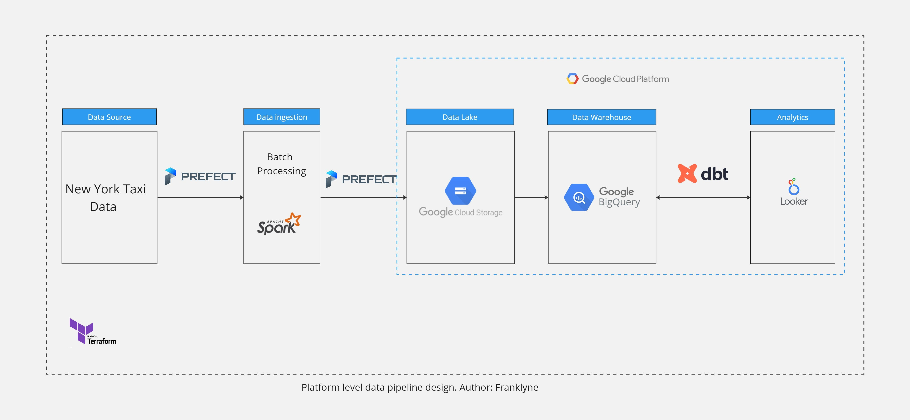
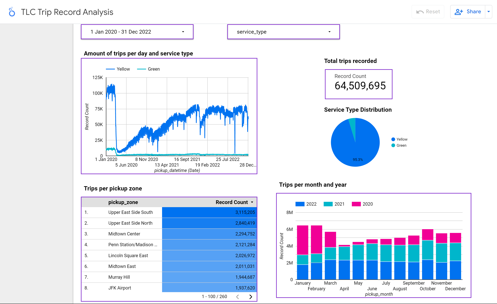

# Building a Data Pipeline for New York Taxi Data

---

## Overview

Welcome to the New York taxi data engineering project! In this project, we aim to create a scalable and automated data pipeline to process and analyze New York taxi trip records.

The goal of this project is to build a reliable and efficient data infrastructure that can handle large volumes of taxi trip data.

The taxi trip data used in this project was sourced from the New York City Taxi and Limousine Commission (TLC). The data set consists of millions of taxi trips spanning several years and includes information such as pickup and dropoff times, locations, fares, and payment methods .

---

## Technologies

This project utilizes the following technologies and tools:

- Google Cloud Platform
  - Google Storage buckets as Data Lake
  - Google Bigquery datasets as Data Warehouse
  - Google Looker Studio reports for Data Visualization
  - Google Compute Engine, if you use a VM on Google's Cloud Platform
- Terraform as Infrastructure as Code, to deploy Buckets and Datasets on Google Cloud Platform
- Python script is used to develop our pipeline from extraction to data ingestion
- Prefect as the orchestration tool
- Apache Spark and Pyspark for  transformation and processing the data in batches.
- Parquet columnar data files
- dbt for some data quality testing, data modelling and transformation, and promotion of data to Production BigQuery dataset.

---

## Architecture

The technical architecture for this project is as show below:

1) Terraform is used to deploy Buckets and Datasets on Google Cloud Platform.

2) Data Extraction is done python & shell script.

3) Run the ETL pipeline, scheduled using Prefect. Data processing is done using Spark and Data is finally ingested into Google Cloud Storage and Google BigQuery.

4) Data building is done using Data Building Tool (dbt).

---

### ETL Pipeline

The ETL process is automated and scheduled using Prefect framework.

The process involves the following steps :

- Extracting the data using Kaggle API
- Create a Spark Session
- Creating Schema for the data set
- Transform and Process the data using Spark
- Ingesting the data into data lake in batches
- Uploading the data to big query dataset.

---

## Dashboard

Looker studio dashboard:

The link to lookerstudio dashboard showing the analytics of US Accidents countrywide Traffic Accident Dataset. Visit [dashboard](https://lookerstudio.google.com/reporting/1038f657-02b8-4185-99dd-06542d023e3f/page/ubqLD) for more information.

---

## Running the Project

1) cd to [terraform](./terraform/) run the commands below.
   - `terraform init`
   - `terraform plan`
   - `terraform apply`
2) cd to [workflow](./workflow_orchestration/) and run this command to run the ETL pipeline  and monitor the Job in Prefect UI.
   - `prefect orion start`
   - `python pyspark/etl_web_gcs.py`
  
3) For BigQuery Datawarehouse run the [biq_query.sql](./data_warehouse/big_query.sql) to create tables in the datawarehouse and perform more advanced queries.

4) To build and transform data using dbt cloud visit [dbt_analytics](./dbt_analytics/) folder and run the following commands
   - `dbt run`
   - `dbt test`
